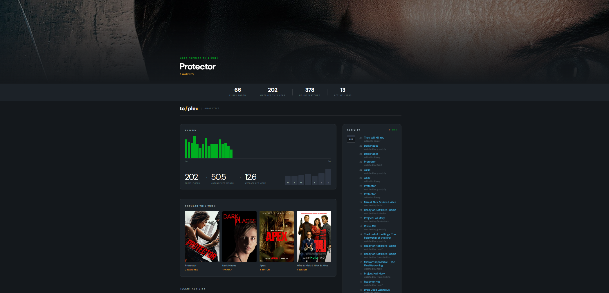

# Plex Analytics Dashboard

Letterboxd-style analytics dashboard for your Plex server.



## Stack

- **Backend** — FastAPI + plexapi (Python)
- **Frontend** — React + Vite

---

## Setup

### 1. Backend

```bash
cd backend
cp .env.example .env          # fill in your PLEX_BASE_URL and PLEX_TOKEN
pip install -r requirements.txt
uvicorn main:app --reload     # runs on http://localhost:8000
```

### 2. Frontend

```bash
cd frontend
npm install
npm run dev                   # runs on http://localhost:5173
```

Open **http://localhost:5173** in your browser.

---

## Getting your Plex token

1. Sign in to app.plex.tv
2. Open any media item → click ··· → "Get Info"
3. View XML — the token is in the URL as `X-Plex-Token=...`

Or follow the [official guide](https://support.plex.tv/articles/204059436-finding-an-authentication-token-x-plex-token/).

---

## Architecture

```
Browser → Vite dev server (/api/* proxied) → FastAPI → Plex Server
```

Plex images are proxied through `/proxy/image` so the Plex token is never
sent to the browser.

---

## API Endpoints

| Method | Path | Description |
|--------|------|-------------|
| GET | `/users` | All server accounts derived from watch history |
| GET | `/users/{id}/recent?limit=4` | Last N movies watched by a user |
| GET | `/analytics/top-movies?range=7d&limit=4` | Most-watched movies this period |
| GET | `/analytics/stats` | YTD stats: films added, watches, hours, active users |
| GET | `/analytics/charts` | Weekly watch counts + day-of-week breakdown (YTD) |
| GET | `/analytics/activity?limit=20` | Live feed: recent watches + library additions |
| GET | `/movie/info?movie_id=...` | Full movie metadata from Plex (genres, cast, director, rating) |
| GET | `/proxy/image?path=...` | SSRF-safe proxy for Plex poster images |

Responses are cached in-memory for 60 seconds.

---

## Notes

- The backend uses `PlexServer.systemAccounts()` to list users — these IDs
  match `item.accountID` in watch history, which is what history filtering
  relies on.
- Requires a Plex admin token to read history across all accounts.
- No database — all data is fetched live from Plex and cached in memory.
